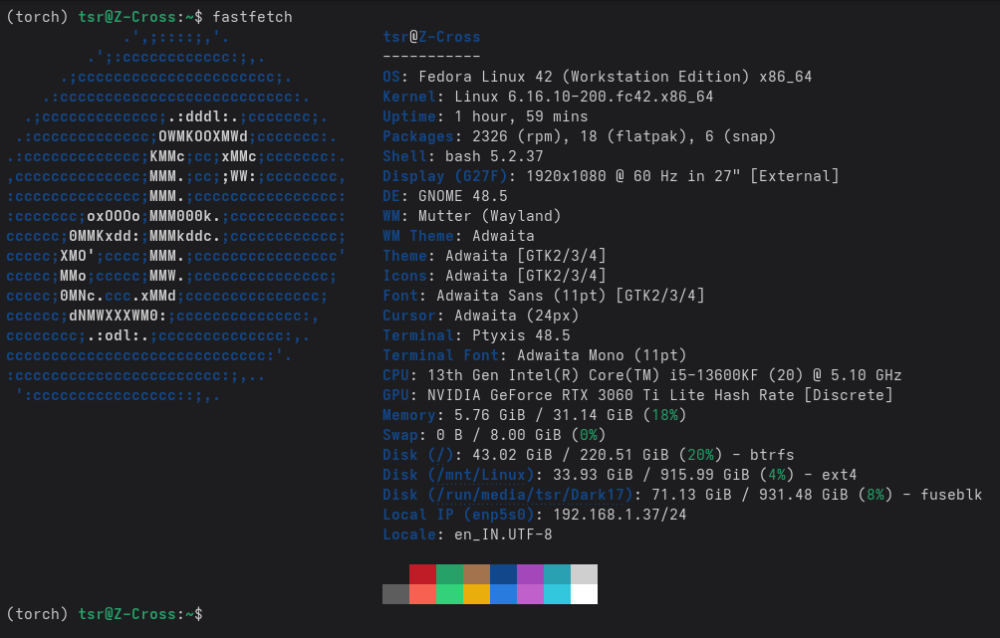
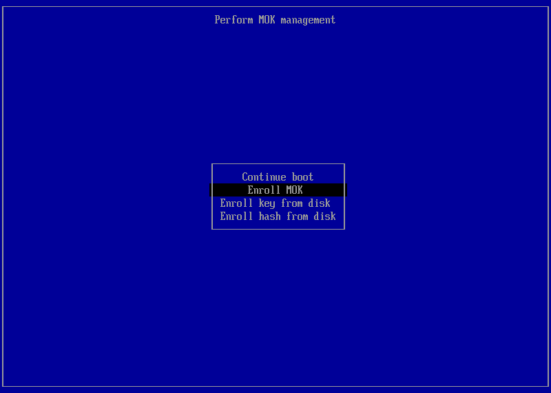
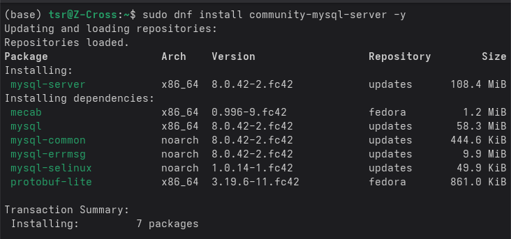
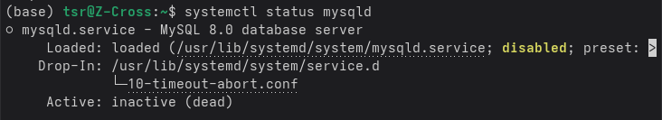
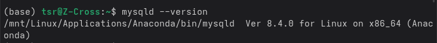
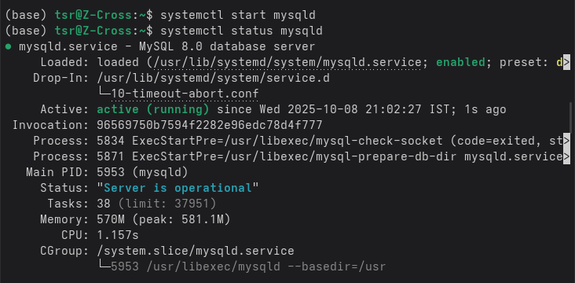
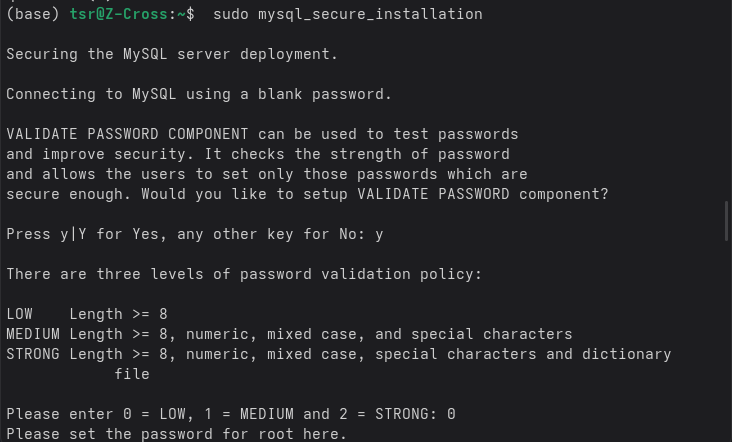

# Nvidia Driver Installation

1. Make sure your kernel and applications are updated

```bash
$ sudo dnf update
```

2. Disable all non Linux OS because your system will reboot many times. Make sure that your safe boot is enabled.

3. For determining GPU Model. This cmd will show you the result as showing in the image below.
```bash
$ sudo dnf install fastfetch
```


4. Install dependencies
```bash
$ sudo dnf install kmodtool akmods mokutil openssl
```

5. It is will create a key to sign driver
```bash
$ sudo kmodgenca -a
```

6. Enter password. I recommend you to use simple password for creating the key, eg. 1234
```bash
$ sudo mokutil --import /etc/pki/akmods/certs/public_key.der
```

7. Reboot system
```bash
$ systemctl reboot
```

8. After rebooting you will be directed to MOK (Machine Owner Key Enrollment). A similar interface will be showing you as shown in the image below:

Press Enroll MOK using keyboard and continue to enroll the key and put the password which you used while creating the key which was 1234

9. After reboot, you will be boot to your normal OS interface which means you have successfully enrolled your key.
Now it’s time to install Nvidia Driver. For that follow these cmds -
```bash
$ sudo dnf install akmod-nvidia
$ sudo dnf install xorg-x11-drv-nvidia-cuda
```

10. Reboot system
```bash
$ systemctl reboot
```

11. To check whether driver is installed or not
```bash
$ modinfo -F version nvidia
```

*Well congrats you have successfully installed your Nvidia Driver!*

# Anaconda
1. Download Anaconda for Linux 64-Bit (x86) installer from - [Distribution Installer](https://www.anaconda.com/download/success)
*You can download either Anaconda or Miniconda, but Anaconda is recommended*

2. Make sure you are in Downloads directory in your terminal
```bash
$ cd Downloads
```

3. Give permission to the file
```bash
$ chmod +x <file-name.sh>
```

4. Open sh file
```bash
$ bash <file-name.sh>
```
*If you want to install it in your mount drive directory, use this cmd where after accepting licence you can provide path where you want to download.*
```bash
$ bash <file-name.sh> -u
```

5. For installation verification
```bash
$ conda --version
```

*Congratulation you have successfully installed Anaconda in your Fedora!*

# MySQL with Workbench
1. Make sure your kernel and other applications are up-to date.
```bash
$ sudo dnf update
```

2. Install dependencies
```bash
$ sudo dnf install community-mysql-server -y
```


3. Checking SQL status
```bash
$ systemctl status mysqld
```


4. Check SQL version
```bash
$ mysqld --version
```


5. Start SQL
```bash
$ sudo systemctl enable mysqld
```
*Check status again using 4th step cmd. If it still shows mysql as dead. Follow this cmd:*
```bash
$ sudo systemctl start mysqld
```


6. Create password for sql
```bash
$ sudo mysql_secure_installation
```
*Follow the further inputs as per your requirement.*


7. Run SQL
```bash
$ sudo mysql -u root -p
```

*Congratulation you have successfully installed MySQL Community!*

## Now we will install MySQL Workbench

8. Install snapd for smooth installation
```bash
$ sudo dnf install snapd
```

9. Create Symbolic Link
```bash
$ sudo ln -s /var/lib/snapd/snap /snap
```

10 Install MySQL workbench
```bash
$ sudo snap install mysql-workbench-community
```

*Congratulation you’ve successfully installed MySQL Workbench!*

# Docker
1. Set up the repository
```bash
$ sudo dnf -y install dnf-plugins-core
$ sudo dnf-3 config-manager --add-repo https://download.docker.com/linux/fedora/docker-ce.repo
```

**There are two setup for Docker -> Docker Engine or Docker Desktop**
You can install both but I will recommend you to choose any one. If you want Docker with GUI go with Docker Deskstop other for cli integration go with Docker Engine.

### 2. For Docker Engine
2.1 Install Docker Engine
```bash
$ sudo dnf install docker-ce docker-ce-cli containerd.io docker-buildx-plugin docker-compose-plugin
```

2.2 Start Docker Engine
```bash
$ sudo systemctl enable --now docker
```

*Docker Engine is ready to use!*

### 3. For Docker Desktop
3.1 Download the latest [RPM package](https://docs.docker.com/desktop/setup/install/linux/fedora/#install-docker-desktop)

3.2 Make sure you are on downloads directory
```bash
$ cd Downloads
```

3.3 Install the package
```bash
$ sudo dnf install ./docker-desktop-x86_64.rpm
```

3.4 Launch Docker Desktop
```bash
$ systemctl --user start docker-desktop
```

3.5 Verify installation
```bash
$ docker --version
```

**You will face diffculty SignIn Docker. For that follow steps mentioned below:**
3.6 Generate a GPG key
```bash
$ gpg --generate-key
```

3.7 Enter your name and email once prompted.
```bash
...
pubrsa3072 2022-03-31 [SC] [expires: 2024-03-30]
 3ABCD1234EF56G78
uid          Molly <molly@example.com>
```

3.8 Copy the GPG ID and use it to initialize ```pass```
```bash
$ pass init <your_generated_gpg-id_public_key>
```

You should see output similar to:
```bash
mkdir: created directory '/home/molly/.password-store/'
Password store initialized for <generated_gpg-id_public_key>
```

*You have successfully installed Docker Desktop!*

# OBS

I know OBS is not a developer application, but I still want to include it in this setup guide because many developers will definitely need to install OBS — whether for the virtual camera or for high-resolution screen recording.

1. You can simply install OBS from Software in fedora.

Although installing OBS is usually straightforward, the virtual camera can sometimes cause issues — I’ve experienced this myself. To fix it, simply run the following command.

2. Install a package
```bash
$ sudo dnf install v4l2loopback
```

3. Reboot the system
```bash
$ reboot
```

*Here we go, now it’s working!*